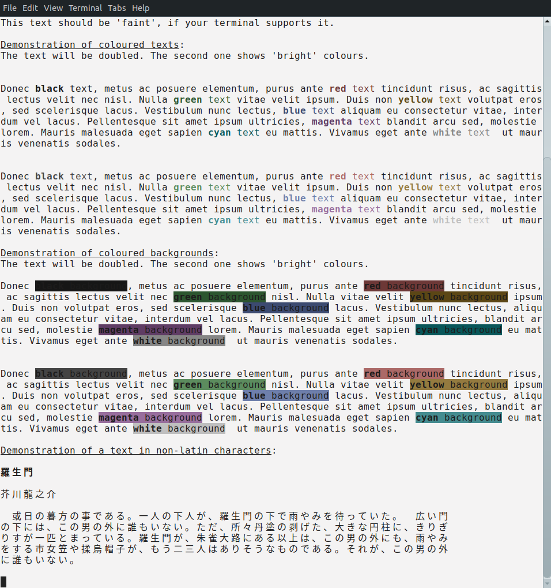
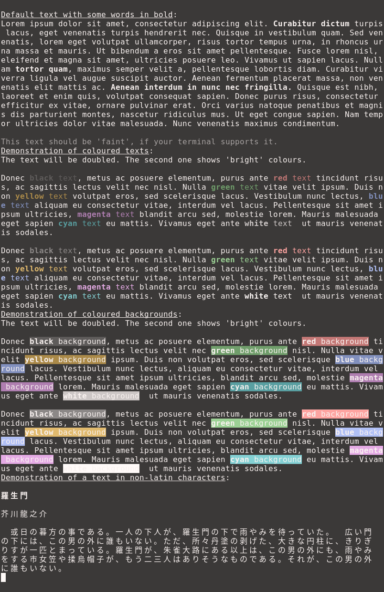

# Harmonia
*Harmonia, the colour scheme for humans* (draft version)

## Introduction

There is no shortage of colour schemes for terminals and other programs. So why another one?

None that I saw felt satisfactory, and I have seen lots.
When I started analysing the reasons for that, I came to a conclusion that a good colour scheme would have to take
into account a variety of diverse factors, and there appears to be no colour scheme which does it satisfactory from 
my point of view.
I am working with computers around 12 hours a day, so for me it is crucially important that my eyes stay healthy.
That is why I have decided to make my humble attempt at improving the situation.

My background (the relevant parts of it) is mostly in mathematics, biology, and computers.
I am not a designer, and I assume that my eyes are not a perfect tool of measurement. So in order to create new palettes
I have defined a set of requirements (see below) and followed them, relying primarily on mathematical relations rather
than my eyes.

**"Harmonia day"** is for casual use in a well-lit environment:

**"Harmonia night"** is more suitable for use in dark environments:

## Implementations

Harmonia will eventually have two parts:
1. Palettes, where colours follow certain principles and precise relations.
2. Colour assignments, linking semantics of information to the colours from the palettes.

Palettes has two versions: "day" (for normal use) and "night" (a light on dark scheme for very dark 
environments):

There are two types of Harmonia palettes:
[Harmonia for ANSI terminals](./terminals/) and [Harmonia for documents](./document/).

## Requirements for Palettes

An ideal colour scheme should be designed with at least the following in mind:
1. Must be gentle to eyes.
2. Must have great contrast between text and background, at least when their colours are default.
3. Must follow existing standards, where applicable. This is especially important in case of ANSI colours.
4. The design must take into account human perception and expected viewing conditions.
5. Where colours are in groups, the lightness and chroma of them must be the same.
6. Should not have vividly-coloured background.

So let's consider them one by one.

### Requirement #1: Being Gentle to Eyes

There is a well known problem with colour schemes: looking at a black text on a white background is like looking at the
sun, and looking at a white text on a black background is like driving in the night and being dazzled by cars.
Often, the blame falls on high contrast. However, the fundamental reasons are different.

When looking at a bright white background, the eye receives a massive amount of light and so some muscles of
the eye (sphincter pupillae) must contract in order to restrict the size of pupil and limit the amount of light coming
in. Looking at the bright screen for hours tires these muscles. On top of that, bright screen can cause glare,
especially for visually-impaired people.

When looking at a bright text on a stark black background, the eye receives a tiny amount of light and so other muscles
of the eye (dilator pupillae) have to work hard to open up the iris and let the light in. This is also tiring to the
eye. On top of that, once the iris is open, the effective brightness of text increases and those bright images on the
black background hit the retina hard. I do not expect it to cause any significant lasting damage, but due to the
biochemistry of the eye, staring at a block of text can make temporary and uneven changes in light sensitivity, which
means that once a person looks at a different part of text, that text is not seen as clearly as it should be.

*Please note, that it is a well accepted fact that for long-term reading, dark text on a light background ("day" scheme)
is a better choice. "Night" scheme is something one may use in special circumstances, such as in a dashboard of a car
when the car is driving in the night.*

So what should be the ideal colour scheme do?

The default background colour - as it determines the average intensity of perceived light - must be neither 
stark black nor stark white. Ideally, its luminance should be close to that of the surrounding field.

***Harmonia's approach***:

There are two variants of the scheme: "day schema" for work in a well lit environment and
"night" for work in a dark one.
* The "day" scheme assumes reasonably lit surroundings (as in an average office) and has dark text on light
(but not white) background.
* The "night" scheme assumes dark surrounding environment and has dark (but not black) background and light text.

### Requirement #2: Great Contrast Between Text and Background

It is very important for the contrast between text and background to be high enough. Low contrast harms readability
and may make the colour scheme be unusable for people with even minor visual impairments.

There are various definitions of contract. As a useful guidance, World Wide Web Consortium provides a definition for
brightness and requires that the contrast between text and background must be at least 7:1 in order for the text to be
well visible by people with minor visual impairments.
You can read more about it [here](https://www.w3.org/WAI/WCAG21/Understanding/contrast-minimum.html).

***Harmonia's approach***:

The contrast between default text colour and default background colour is at least 7 to 1.

### Requirement #3: Follow Existing Standards

Specifically in the context of terminals, there is a number of standards and conventions which must be followed.
Ignoring them may mean that existing applications or configurations will not work as expected.

There is a notable standard on how to specify colours of text and background via
[ANSI escape codes](https://en.wikipedia.org/wiki/ANSI*escape*code). Among other things it defines eight "normal"
colours, eight "bright" colours (less universally present), and mentions default text and background colours.

The standard does not define the meaning of default text and background colours, although historically the default
background colour was black and default foreground colour was white or grey on terminals capable of supporting colours.

The standard does not require that the colour sets of text and background would match, but I am not aware of any
terminal application which would make this difference. So effectively there are sixteen colours plus default ones for
both text and background.

Each group of eight ANSI colours has "black", "red", "green", "blue", "yellow", "cyan", "magenta", and "white".
The effective meaning of "black" and "white" is "darker and lighter grays". Also, historically the "bright" group of
colours had a higher intensity.

***Harmonia's approach***:

Harmonia for terminals provides all sixteen colours.
"Black" and "white" of both groups result in four shades of grey, one of each is black and another one is white.
All sixteen colours have hues and meanings as defined by the ANSI standard, no exceptions. 

### Requirement #4: Human Perception and Viewing Conditions

It is hard to overestimate how complex human visual perception is. We are not machines. While your screen is emitting
light in three narrow-bands of red, green, and blue, the eye does not really see it this way. The way it reports the
image to the brain is different still. And what a brain does with that image is a yet another story.
There is no symmetry in how we view the world and the perception is always context-dependent.

In a bid to understand how human perception works and make use of it, various models and colour spaces were developed
over decades.

For example, [CIE XYZ](https://en.wikipedia.org/wiki/CIE*1931*color*space) is a model which attempts to model how retina
perceive the light. In it, "Y" corresponds to luminance, "Z" is close in meaning to "blue", and combinations of "X" and
"Z" define a colour plane of all perceivable colours of the same luminance.

In a more modern [CIE LAB](https://en.wikipedia.org/wiki/CIELAB*color*space), "L" is lightness, "a" is a position
between green and red, and "b" is a position between blue and yellow.

An even more modern and rather complex [CIECAM02](https://en.wikipedia.org/wiki/CIECAM02) is a colour appearance model
which takes into account a plethora of factors: type of illuminant, luminance of the surrounding field, luminance of the
background, etc. It also provides a number of different ways to describe colour, which may seem identical
to non-professionals: lightness vs brightness, chroma vs colourfulness vs saturation.

***Harmonia's approach***:

Harmonia uses CIECAM02 as the foundation. The luminance of surrounding field is chosen
as "average" for the "day" scheme and "dark" for the "night" scheme. Illuminant is D65 in both cases. The relative
luminance of background *Yb* is chosen to be close to the luminance of the default background, so that the model could
estimate the appearance of colours correctly.

The focus is on colours of text as seen on the default background. However, the scheme is designed to produce readable
text (of default colour) on coloured backgrounds too.

Harmonia does not aim to be "symmetric" in a sense that accent colours stay the same when switching between "day" and
"night" schemes. This is deliberate. There is no value in this symmetry whatsoever, as human visual perception is
fundamentally asymmetric. Instead, harmonia aims to achieve practical and aesthetic benefits by maintaining sameness
of lightness and colourfulness within each group of colours as well as contrast-based relations between groups.
The contrast is computed as a difference in luminance.

### Requirement #5: Sameness of Lightness and Colourfulness

This may seem like a very subjective need, but actually it has an objective foundation.

Colours related to the same group of accent colours should have the same lightness and colourfulness so that they would
be more interchangeable and the choice of hue would be driven exclusively by semantic considerations.

Furthermore, if a text is shown in various colours from the same group, but the lightness or colourfulness between them
differs, that would inevitably lead to a biased perception, making some of the text seem more important while
de-emphasising other parts without a good reason for that.

***Harmonia's approach***:

Colours belonging to the same group are chosen to have the same J (lightness) and C (chroma) in CIECAM02's 
JCh coordinates. This also implies that the colours would have the same M (colourfulness), Q (brightness),
and s (saturation) within the scope of the same group under the same viewing conditions.

### Requirement #6: No Vividly-Coloured Background

This is a result of a simple fact that the appearance of images depends on the colour of the surroundings.
Vividly-coloured default background can distort the perception of text and likely reduce effective contrast.

***Harmonia's approach***:

When producing colours for the default text and background, colourfulness of zero is used.
This means that the resulting colours are shades of gray. Although to be precise, the complex transformations on the
path from CIECAM02's JCh space to sRGB mean that the resulting colours do not necessarily have identical values
of red, green, and blue components.

## Requirements for Colour Assignments

1. The choice of colours must be semantically reasonable, where applicable.
2. Where possible, should provide features like highlighting, which must also be semantically correct.

### Requirement #1: Semantically Reasonable Choice of Colours

Generally speaking, the meaning of colours is neither cross-cultural nor well-defined.

However, there are some exceptions. Red colour means danger or immediate problem and that seems to be universal.

Orange and yellow are somewhat close to red. They may mean a less immediate problem or a warning.

Green may mean that "all is good".

It is believed that other colours have much less defined meanings.

***Harmonia's approach***:

Where a colour is needed to show an error requiring an immediate attention, the brightest possible red is used.
In Harmonia for Documents there is a special red colour for this purpose, which is deliberately chosen in a way 
which is breaking the harmony of other colours.

Where an error exist but does not require an immediate attention, a red colour from a standard colour group is to be 
used.

Red is never used to show anything other than an error.

Where there is a need to show a warning, then either orange or yellow from a colour group is to be used.
Orange and yellow are never used to show anything other than a warning except for situation where it is
absolutely clear that these colours do not signal a warning.

Green colour from a colour group is to be used where it is needed to show that something is working well.

### Requirement #2: Support for Highlighting

In some situations it is important to use highlighting. For example, the current line may need to be highlighted to
provide a visual clue as to where the cursor is.
A similar example is a block cursor, possibly positioned on a character.

In other situations the highlighting is used to show selected text.

***Harmonia's approach***:

Where there is a need to highlight the current line, it is done by changing the lightness of the default background
(and optionally default text) to have higher contrast. The change does not have to be substantial.
Here the colours are called "emphasised".

For the purpose of selecting the colour of a block cursor, where possible, the cursor is shown in emphasised
default background and the text below it is in emphasised default foreground.

When a text is selected, the selection is using de-emphasised default foreground colour for the background and
de-emphasised default background for the text.

## Acknowledgements

This work is based on [CIECAM02 model](https://en.wikipedia.org/wiki/CIECAM02)
by the International Commission on Illumination (CIE).

Special thanks for an excellent colour space library [colorspacious](https://github.com/njsmith/colorspacious).
Without it, the work of creating palettes would have been very hard indeed.