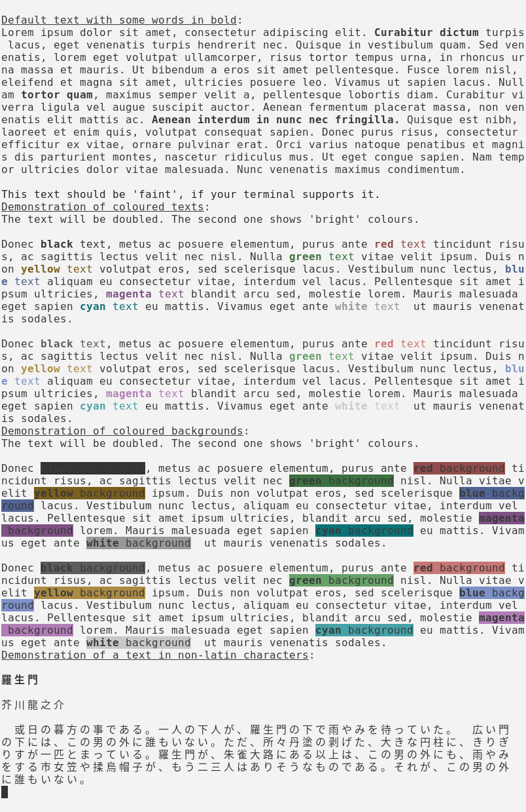
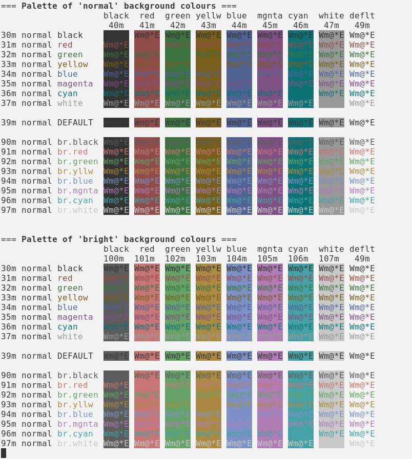
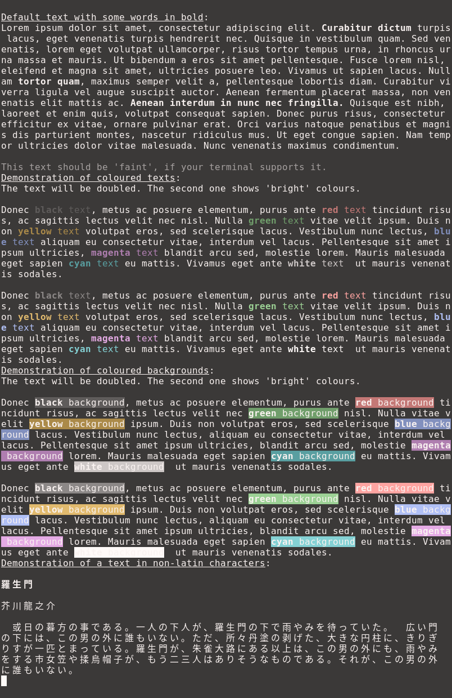

# Harmonia for ANSI Terminals

This type of [Harmonia](../) is designed for ANSI terminals, which is almost all terminals in existence today.

## Special Requirements

There are standard ANSI sequences selecting the colours which can be displayed by a terminal.
The standard defines eight colours (including black and white).
Further extensions add "bright" colours, which on many terminals are shown erroneously via bold text, and faint 
colours.
Also, there is an idea of a default text and default background.

This standard was developed at a time when all terminals were of a "bright text on black background" variety.
When attempting to implement this standard with a palette where there is dark text on a bright background, the 
meaning of "bright" and "faint" is up to a debate.

Harmonia is trying to be faithful to the standard and do the right thing where the standard is not entirely clear.
Also, where choosing the brightness, colourfulness, and other attributes of colours, the guiding principle is that 
normal and coloured text has to be clearly visible on a default background. Other combinations are deemed to be less 
important.

## Colour schemes

### Harmonia for KDE Konsole

These colour schemes should be present on KDE Store.

Alternatively, you can download the files here, and put them into ~/.local/share/konsole/ directory,
and restart Konsole application (otherwise it will not notice that the files are present).

After that you could be select the colour preset by right-clicking on the terminal, and then going to
"Edit current profile ..." > "Colour scheme & font".

* ["Harmonia day"](konsole/harmonia-day.colorscheme) (dark text on light background)
* ["Harmonia night"](konsole/harmonia-night.colorscheme) (light text on dark background)

### Harmonia for Xfce4 Terminal

It should be enough to put the files into ~/.config/xfce4/terminal/colorschemes directory.

After that you could be select the colour preset by right-clicking on the terminal, and then going to
"Preferences ..." > "Colours" > "Load presets ...".

* ["Harmonia day"](xfce4-terminal/harmonia-day.theme) (dark text on light background)
* ["Harmonia night"](xfce4-terminal/harmonia-night.theme) (light text on dark background)

### Harmonia for XTerm

Programs like xterm use the traditional configuration method where configuration files are loaded into X11 system
via a program like xrdb. The precise way the configuration is done is specific to your Linux / UNIX system.

On some systems it is enough to put the content of Xresources file into .Xresources file in your home directory.
After that the files are loaded automatically upon starting an X11 session. Sadly, not every system does it.

For testing purposes, you can load the files manually and see if your xterm has loaded them up: 

```shell
cat Xresources-harmonia-day | xrdb
xterm +pc
```

*Note: `+pc` tells xterm to avoid PC behaviour where bold text is simulated by choosing a bright colour.
Any modern terminal running in a graphical environment (and perhaps even some working in a pure text mode)
should be capable of using actual bold fonts.*

* [Xresources file](xterm/Xresources-harmonia-day) for "Harmonia day" (dark text on light background)
* [Xresources file](xterm/Xresources-harmonia-night) for "Harmonia night" (light text on dark background)

## Demonstration

## Harmonia "day"

[](./Text-legibility-Harmonia-day.png)

[](./ANSI-colours-Harmonia-day.png)

## Harmonia "night"

[](./Text-legibility-Harmonia-night.png)

[](./ANSI-colours-Harmonia-night.png)
