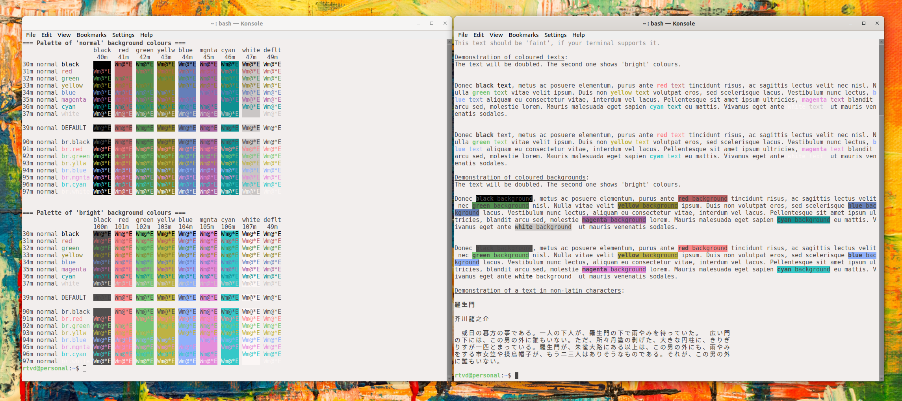
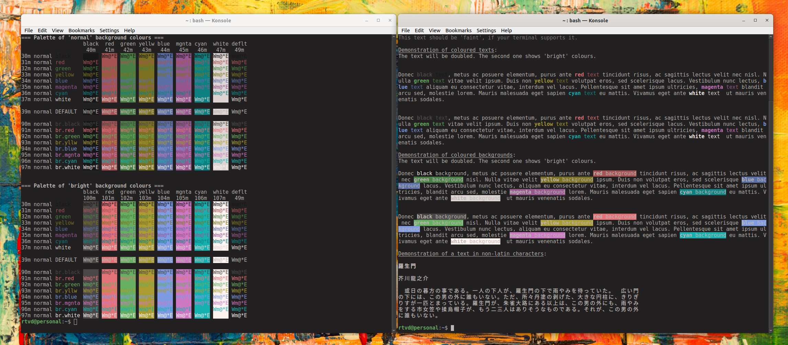

# Harmonia for KDE Konsole
(pre-alpha version)

## Installation

These colour schemes should be present on KDE Store.

Alternatively, you can download the files here, and put them into ~/.local/share/konsole/ directory,
and restart Konsole application (otherwise it will not notice that the files are present).

After that you could be select the colour preset by right-clicking on the terminal, and then going to
"Edit current profile ..." > "Colour scheme & font".

## Colour Schemes

Please download here:

* ["Harmonia day"](harmonia-day.colorscheme) (dark text on light background)
* ["Harmonia night"](harmonia-night.colorscheme) (light text on dark background)

### Screenshots

Palette for well-lit environments:

Palette for dark environments:
