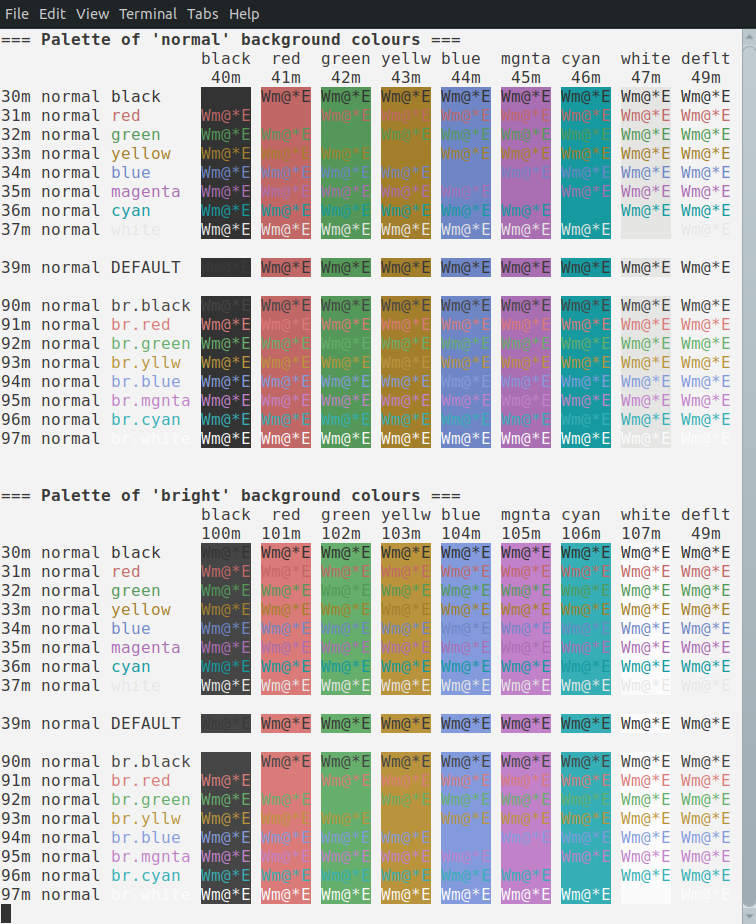
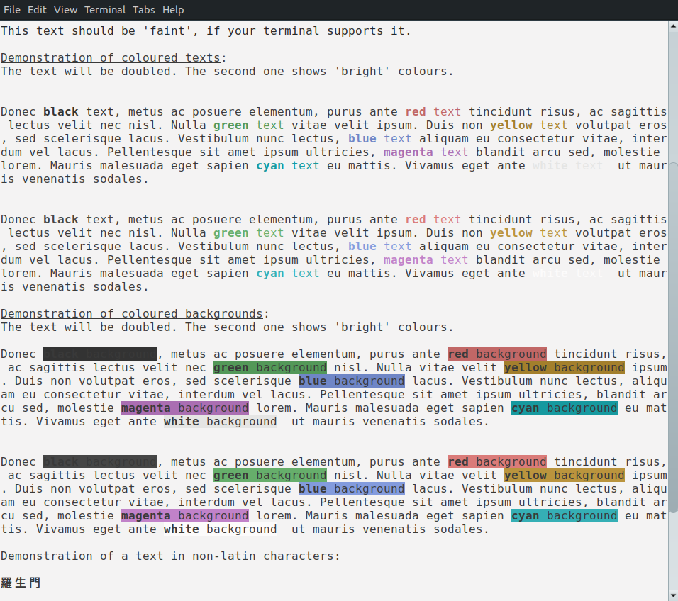
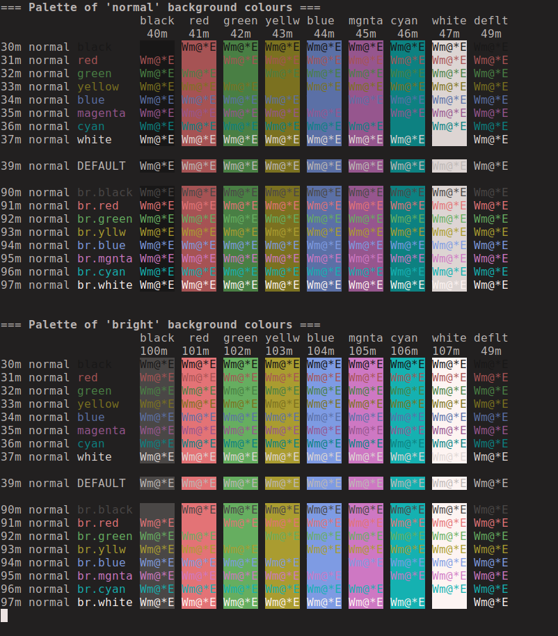
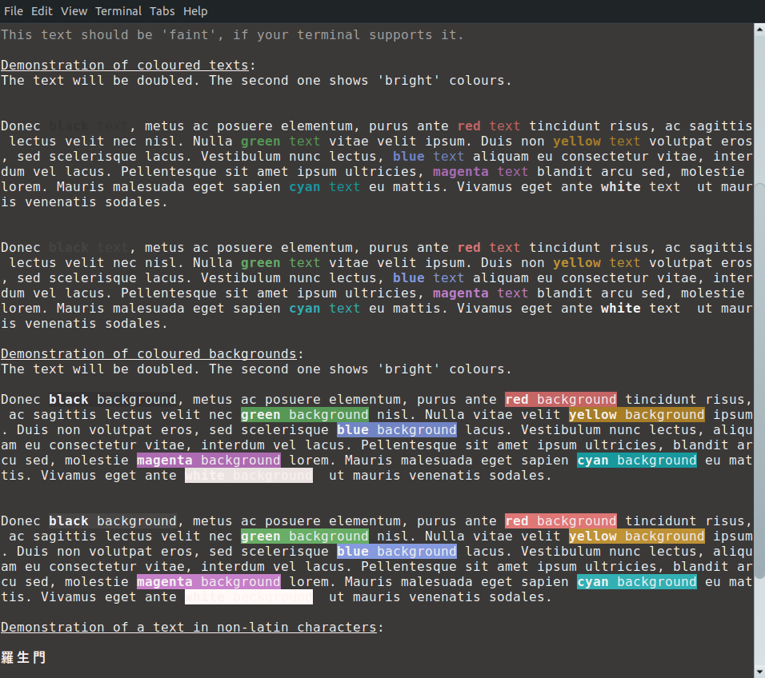

# Harmonia for Xfce4 Terminal
(pre-alpha version)

## Installation

It should be enough to put the files into ~/.config/xfce4/terminal/colorscheme directory.

After that you could be select the colour preset by right-clicking on the terminal, and then going to
"Preferences ..." > "Colours" > "Load presets ...".

## Colour Schemes

Please download here:

* ["Harmonia day"](harmonia-day.theme) (dark text on light background)
* ["Harmonia night"](harmonia-night.theme) (light text on dark background)

## Screenshots

### Harmonia "day"

Demonstration of ANSI colours:

Text legibility test:

### Harmonia "night"

Demonstration of ANSI colours:

Text legibility test:
